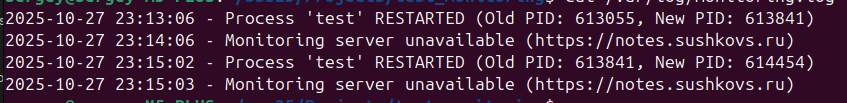

# Test Process Monitor

## Описание проекта

Скрипт на bash для мониторинга процесса `test` в среде Linux.

### Требования:
1. Запускаться при запуске системы (через systemd unit)
2. Отрабатывать каждую минуту
3. Если процесс запущен, отправлять HTTPS-запрос на сервер мониторинга
4. Если процесс был перезапущен, записывать информацию в лог `/var/log/monitoring.log`
5. Если сервер мониторинга недоступен, также записывать в лог

## Структура проекта

```
.
├── test                      # Тестовый процесс для мониторинга
├── test_monitor.sh           # Скрипт мониторинга
├── test_monitor.service      # Systemd-сервис
├── test_monitor.timer        # Systemd-таймер (запуск каждую минуту)
├── monitor.conf              # Файл конфигурации (LOG_FILE, PID_FILE, MONITORING_URL)
├── run.sh                    # Скрипт развертывания
└── stop.sh                   # Скрипт остановки и очистки
```

## Быстрый старт

### 1. Скорректируйте файл конфигурации

Скорректируйте, если нужно файл `monitor.conf` в корне проекта:

```bash
LOG_FILE="/var/log/test_monitor.log"
PID_FILE="/var/run/test_monitor.pid"
MONITORING_URL="https://notes.sushkovs.ru"
```

### 2. Запуск мониторинга

```bash
./run.sh
```

Скрипт `run.sh` автоматически:
- Запускает тестовый процесс `test` в фоновом режиме
- Копирует файл конфигурации в `/etc/test_monitor.conf`
- Копирует `test_monitor.sh` в `/usr/local/bin/`
- Устанавливает systemd-сервис и таймер
- Создает лог-файл и PID-файл
- Активирует и запускает таймер мониторинга

### 3. Остановка мониторинга

```bash
./stop.sh
```

Скрипт `stop.sh` автоматически:
- Останавливает процесс `test`
- Отключает и удаляет systemd-юниты
- Удаляет лог-файл, PID-файл и скрипт из `/usr/local/bin/`
- Удаляет файл конфигурации `/etc/test_monitor.conf`

## Проверка работы

### Статус таймера
```bash
systemctl status test_monitor.timer
systemctl list-timers | grep test_monitor
```

### Просмотр логов systemd
```bash
journalctl -u test_monitor.service -f
```

### Просмотр лог-файла мониторинга
```bash
cat /var/log/test_monitor.log
```

### Ручной запуск скрипта мониторинга
```bash
sudo /usr/local/bin/test_monitor.sh
```

## Как это работает

1. **Таймер (`test_monitor.timer`)** запускается каждую минуту по расписанию (`OnCalendar=*:0/1`)
2. **Сервис (`test_monitor.service`)** запускает скрипт `test_monitor.sh`
3. **Скрипт мониторинга** проверяет:
   - Запущен ли процесс `test` (через `pgrep`)
   - Изменился ли PID (сравнение с сохраненным в `/var/run/test_monitor.pid`)
   - Доступен ли сервер мониторинга (HTTPS-запрос через `curl`)
4. При обнаружении перезапуска или недоступности сервера — запись в лог

## Примеры записей в логе


